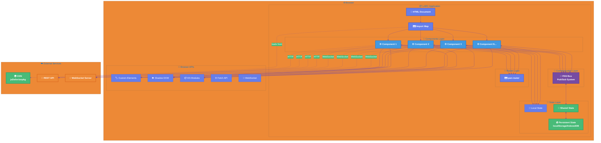
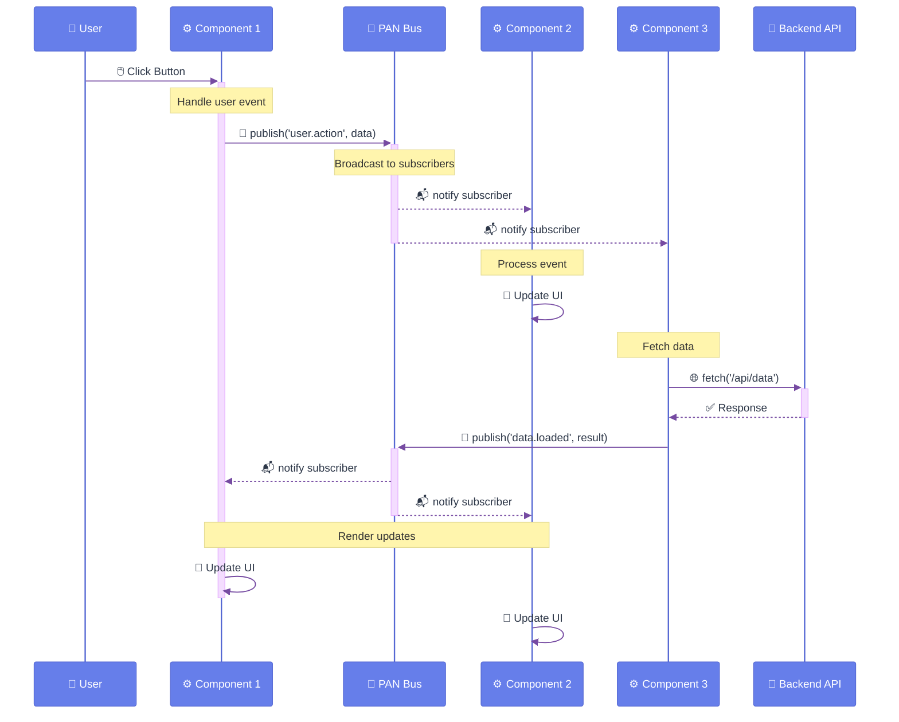
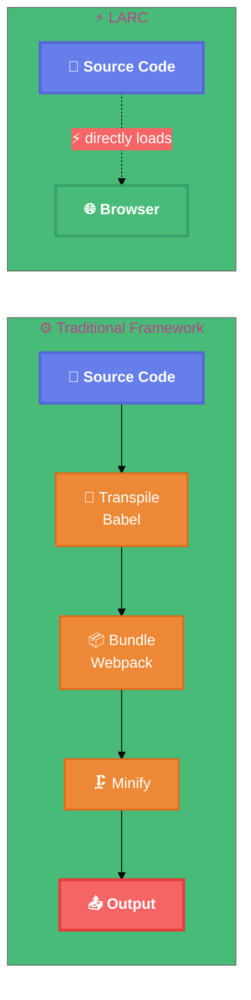
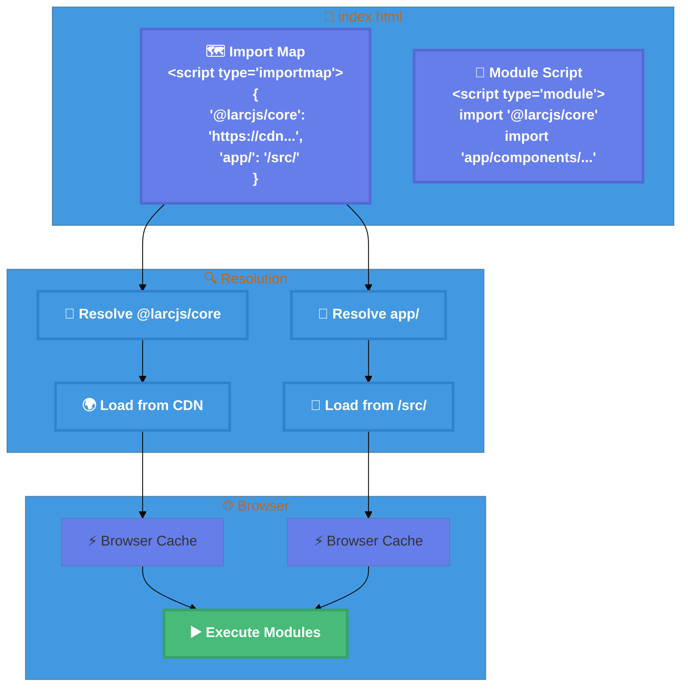
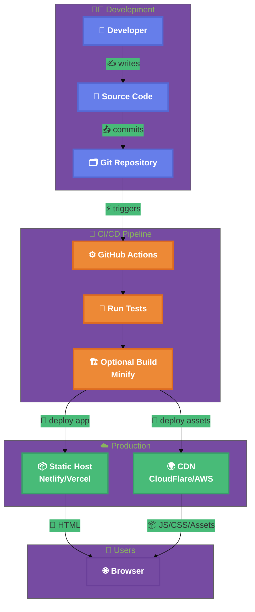

# LARC Architecture Overview

## High-Level Architecture

```mermaid
%%{init: {'theme':'base', 'themeVariables': { 'primaryColor':'#667eea','primaryTextColor':'#fff','primaryBorderColor':'#5568d3','lineColor':'#764ba2','secondaryColor':'#48bb78','tertiaryColor':'#ed8936'}}}%%
graph TB
    subgraph Browser["🌐 Browser"]
        subgraph App["📦 LARC Application"]
            HTML["📄 HTML Document"]
            IM["🗺️ Import Map"]

            subgraph Components["🧩 Components Layer"]
                C1["⚙️ Component 1"]
                C2["⚙️ Component 2"]
                C3["⚙️ Component 3"]
                C4["⚙️ Component N..."]
            end

            subgraph Comm["💬 Communication Layer"]
                PAN["🚌 PAN Bus<br/>Pub/Sub System"]
            end

            subgraph State["💾 State Layer"]
                LS["📝 Local State"]
                SS["🔗 Shared State"]
                PS["💿 Persistent State<br/>localStorage/IndexedDB"]
            end

            subgraph Router["🧭 Router Layer"]
                R["🗺️ pan-router"]
            end
        end

        subgraph APIs["🔧 Browser APIs"]
            CE["🏷️ Custom Elements"]
            SD["👁️ Shadow DOM"]
            ESM["📦 ES Modules"]
            F["🌐 Fetch API"]
            WS["🔌 WebSocket"]
        end
    end

    subgraph External["☁️ External Services"]
        CDN["🌍 CDN<br/>jsDelivr/unpkg"]
        API["🔌 REST API"]
        WSS["🔌 WebSocket Server"]
    end

    HTML --> IM
    IM --> C1 & C2 & C3 & C4
    C1 & C2 & C3 & C4 <--> PAN
    C1 & C2 & C3 & C4 --> LS
    PAN <--> SS
    SS <--> PS
    C1 & C2 & C3 & C4 --> CE & SD & ESM
    C1 & C2 & C3 & C4 --> R

    IM -.loads from.-> CDN
    C1 & C2 & C3 & C4 -.HTTP.-> API
    C1 & C2 & C3 & C4 -.WebSocket.-> WSS

    classDef primary fill:#667eea,stroke:#5568d3,stroke-width:3px,color:#fff,font-weight:bold
    classDef secondary fill:#764ba2,stroke:#6a3f99,stroke-width:3px,color:#fff,font-weight:bold
    classDef success fill:#48bb78,stroke:#38a169,stroke-width:3px,color:#fff,font-weight:bold
    classDef warning fill:#ed8936,stroke:#dd6b20,stroke-width:3px,color:#fff,font-weight:bold
    classDef info fill:#4299e1,stroke:#3182ce,stroke-width:3px,color:#fff,font-weight:bold

    class HTML,IM,R primary
    class PAN secondary
    class SS,PS,CDN success
    class API,WSS warning
    class C1,C2,C3,C4 info
```

## Component Communication Flow

```mermaid
%%{init: {'theme':'base', 'themeVariables': { 'actorBkg':'#667eea','actorBorder':'#5568d3','actorTextColor':'#fff','signalColor':'#764ba2','signalTextColor':'#2d3748','labelBoxBkgColor':'#f7fafc','labelBoxBorderColor':'#cbd5e0'}}}%%
sequenceDiagram
    participant U as 👤 User
    participant C1 as ⚙️ Component 1
    participant PAN as 🚌 PAN Bus
    participant C2 as ⚙️ Component 2
    participant C3 as ⚙️ Component 3
    participant API as 🔌 Backend API

    U->>+C1: 🖱️ Click Button
    Note over C1: Handle user event
    C1->>+PAN: 📢 publish('user.action', data)
    Note over PAN: Broadcast to subscribers

    PAN-->>C2: 📬 notify subscriber
    PAN-->>-C3: 📬 notify subscriber

    Note over C2: Process event
    C2->>C2: 🎨 Update UI

    Note over C3: Fetch data
    C3->>+API: 🌐 fetch('/api/data')
    API-->>-C3: ✅ Response
    C3->>+PAN: 📢 publish('data.loaded', result)

    PAN-->>C1: 📬 notify subscriber
    PAN-->>-C2: 📬 notify subscriber

    Note over C1,C2: Render updates
    C1->>-C1: 🎨 Update UI
    C2->>C2: 🎨 Update UI
```

## No-Build Architecture

```mermaid
%%{init: {'theme':'base', 'themeVariables': { 'primaryColor':'#667eea','primaryTextColor':'#fff','secondaryColor':'#f56565','tertiaryColor':'#48bb78'}}}%%
graph LR
    subgraph Traditional["⚙️ Traditional Framework"]
        S1["📝 Source Code"]
        T1["🔄 Transpile<br/>Babel"]
        B1["📦 Bundle<br/>Webpack"]
        M1["🗜️ Minify"]
        O1["📤 Output"]

        S1 --> T1 --> B1 --> M1 --> O1
    end

    subgraph LARC["⚡ LARC"]
        S2["📝 Source Code"]
        BR["🌐 Browser"]

        S2 -.⚡ directly loads.-> BR
    end

    classDef source fill:#667eea,stroke:#5568d3,stroke-width:3px,color:#fff,font-weight:bold
    classDef browser fill:#48bb78,stroke:#38a169,stroke-width:3px,color:#fff,font-weight:bold
    classDef output fill:#f56565,stroke:#e53e3e,stroke-width:3px,color:#fff,font-weight:bold
    classDef process fill:#ed8936,stroke:#dd6b20,stroke-width:2px,color:#fff

    class S2,S1 source
    class BR browser
    class O1 output
    class T1,B1,M1 process
```

## Module Loading with Import Maps

```mermaid
%%{init: {'theme':'base', 'themeVariables': { 'primaryColor':'#667eea','secondaryColor':'#48bb78','tertiaryColor':'#4299e1'}}}%%
graph TB
    subgraph HTML["📄 index.html"]
        IM["🗺️ Import Map<br/>&lt;script type='importmap'&gt;<br/>{<br/>  '@larcjs/core': 'https://cdn...',<br/>  'app/': '/src/'<br/>}"]
        SM["📜 Module Script<br/>&lt;script type='module'&gt;<br/>import '@larcjs/core'<br/>import 'app/components/...'"]
    end

    subgraph Resolution["🔍 Resolution"]
        IM --> R1["🔎 Resolve @larcjs/core"]
        IM --> R2["🔎 Resolve app/"]

        R1 --> CDN["🌍 Load from CDN"]
        R2 --> Local["💾 Load from /src/"]
    end

    subgraph Browser["🌐 Browser"]
        CDN --> Cache1["⚡ Browser Cache"]
        Local --> Cache2["⚡ Browser Cache"]

        Cache1 --> Exec["▶️ Execute Modules"]
        Cache2 --> Exec
    end

    classDef primary fill:#667eea,stroke:#5568d3,stroke-width:3px,color:#fff,font-weight:bold
    classDef success fill:#48bb78,stroke:#38a169,stroke-width:3px,color:#fff,font-weight:bold
    classDef info fill:#4299e1,stroke:#3182ce,stroke-width:3px,color:#fff,font-weight:bold

    class IM,SM primary
    class Exec success
    class R1,R2,CDN,Local info
```

## Deployment Architecture

```mermaid
%%{init: {'theme':'base', 'themeVariables': { 'primaryColor':'#667eea','secondaryColor':'#48bb78','tertiaryColor':'#764ba2'}}}%%
graph TB
    subgraph Dev["👨‍💻 Development"]
        Developer["👤 Developer"]
        Code["📝 Source Code"]
        Git["🗂️ Git Repository"]

        Developer -->|✍️ writes| Code
        Code -->|📤 commits| Git
    end

    subgraph CICD["🔄 CI/CD Pipeline"]
        GH["⚙️ GitHub Actions"]
        Test["🧪 Run Tests"]
        Build["🏗️ Optional Build<br/>Minify"]

        Git -->|⚡ triggers| GH
        GH --> Test
        Test --> Build
    end

    subgraph Prod["☁️ Production"]
        CDN["🌍 CDN<br/>CloudFlare/AWS"]
        Static["📦 Static Host<br/>Netlify/Vercel"]

        Build -->|🚀 deploy assets| CDN
        Build -->|🚀 deploy app| Static
    end

    subgraph Users["👥 Users"]
        Browser["🌐 Browser"]

        Static -->|📄 HTML| Browser
        CDN -->|📦 JS/CSS/Assets| Browser
    end

    classDef developer fill:#667eea,stroke:#5568d3,stroke-width:3px,color:#fff,font-weight:bold
    classDef production fill:#48bb78,stroke:#38a169,stroke-width:3px,color:#fff,font-weight:bold
    classDef user fill:#764ba2,stroke:#6a3f99,stroke-width:3px,color:#fff,font-weight:bold
    classDef cicd fill:#ed8936,stroke:#dd6b20,stroke-width:3px,color:#fff,font-weight:bold

    class Code,Developer,Git developer
    class Static,CDN production
    class Browser user
    class GH,Test,Build cicd
```
