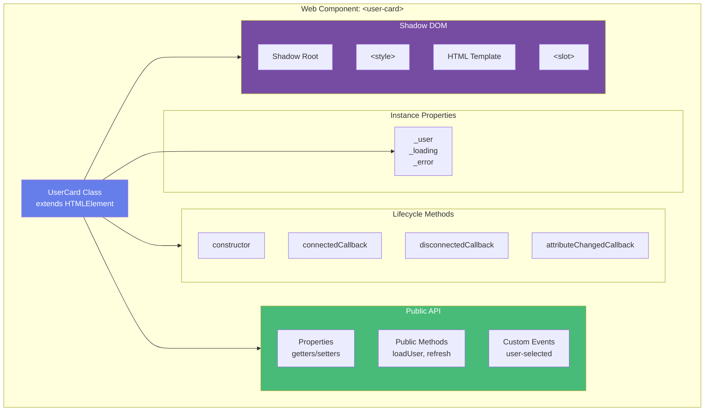
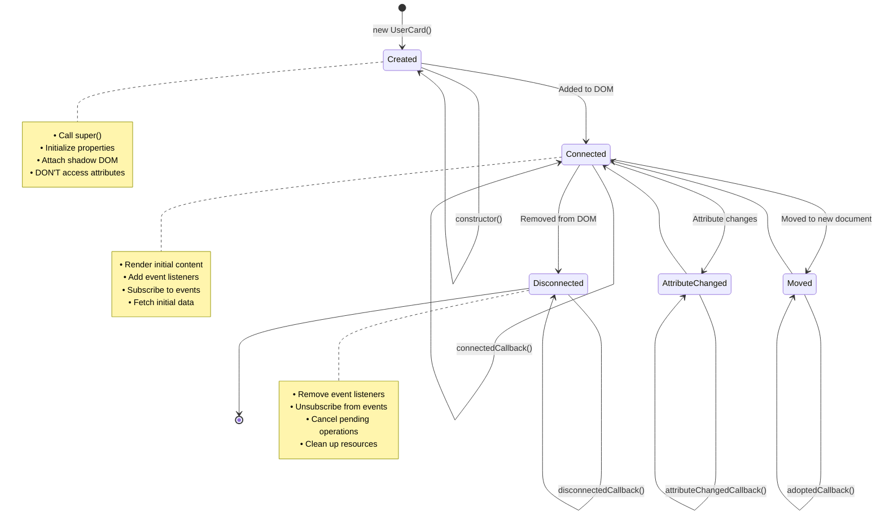
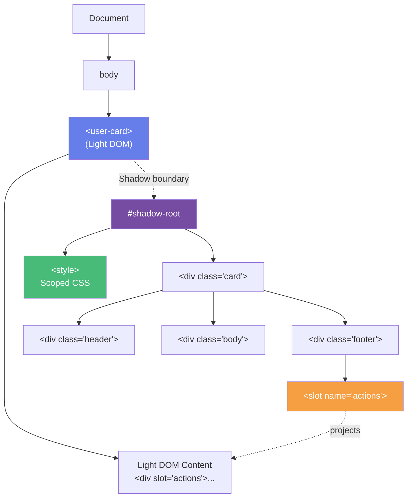
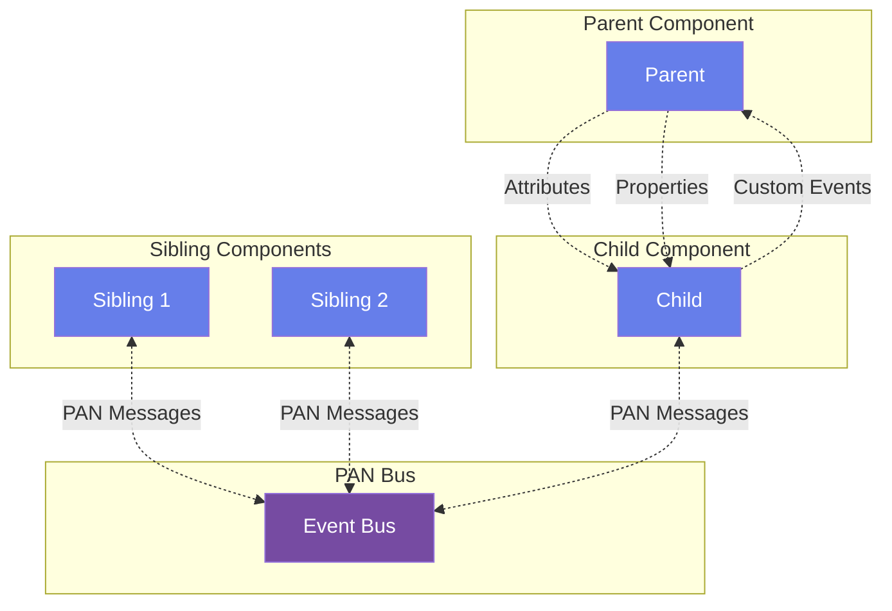
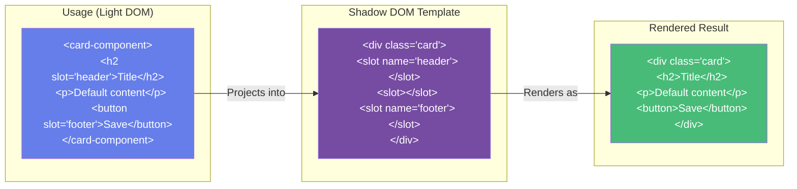
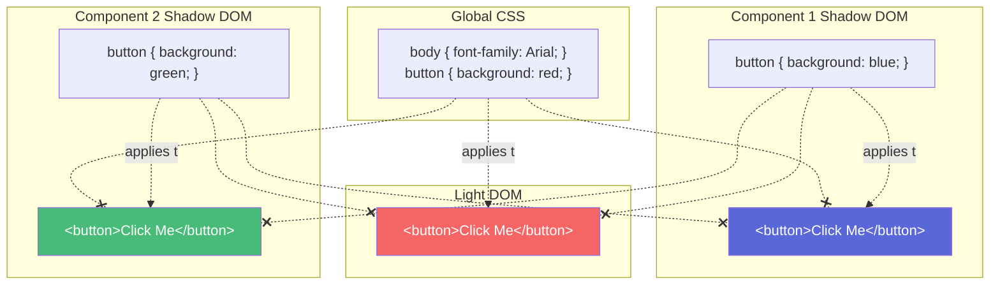
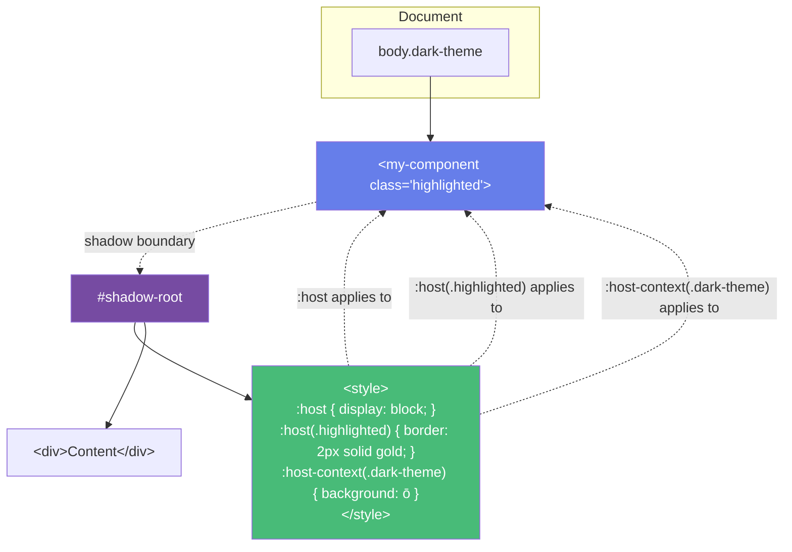

# Web Component Structure

## Component Anatomy

## Component Lifecycle Flow

## Shadow DOM Tree Structure

## Component Communication Patterns

## Slots and Content Projection

## CSS Encapsulation

## :host and :host-context

