# PAN Bus Communication Patterns

## Pub/Sub Architecture

```mermaid
%%{init: {'theme':'base', 'themeVariables': { 'primaryColor':'#667eea','secondaryColor':'#764ba2','tertiaryColor':'#48bb78'}}}%%
graph TB
    subgraph Publishers["📤 Publishers"]
        P1["🔘 Login Button"]
        P2["🛒 Cart Component"]
        P3["🔌 API Service"]
    end

    subgraph PAN["🚌 PAN Bus"]
        Router["📡 Topic Router"]

        subgraph Topics["📋 Topics"]
            T1["🔑 user.login"]
            T2["➕ cart.item.added"]
            T3["📦 data.loaded"]
        end
    end

    subgraph Subscribers["📥 Subscribers"]
        S1["👤 User Menu"]
        S2["📁 Sidebar"]
        S3["🔔 Notification"]
        S4["📊 Analytics"]
    end

    P1 -->|📢 publish| T1
    P2 -->|📢 publish| T2
    P3 -->|📢 publish| T3

    T1 --> Router
    T2 --> Router
    T3 --> Router

    Router -->|📬 notify| S1
    Router -->|📬 notify| S2
    Router -->|📬 notify| S3
    Router -->|📬 notify| S4

    classDef publisher fill:#667eea,stroke:#5568d3,stroke-width:3px,color:#fff,font-weight:bold
    classDef pan fill:#764ba2,stroke:#6a3f99,stroke-width:3px,color:#fff,font-weight:bold
    classDef subscriber fill:#48bb78,stroke:#38a169,stroke-width:3px,color:#fff,font-weight:bold
    classDef topic fill:#4299e1,stroke:#3182ce,stroke-width:2px,color:#fff

    class P1,P2,P3 publisher
    class Router pan
    class S1,S2,S3,S4 subscriber
    class T1,T2,T3 topic
```

## Message Flow Sequence

```mermaid
%%{init: {'theme':'base', 'themeVariables': { 'actorBkg':'#667eea','actorBorder':'#5568d3','actorTextColor':'#fff','signalColor':'#764ba2','signalTextColor':'#2d3748'}}}%%
sequenceDiagram
    participant LoginBtn as 🔘 Login Button
    participant PAN as 🚌 PAN Bus
    participant UserMenu as 👤 User Menu
    participant Sidebar as 📁 Sidebar
    participant Analytics as 📊 Analytics
    participant API as 🔌 Backend

    Note over LoginBtn,Analytics: 🖱️ User clicks login button

    LoginBtn->>+PAN: 📢 publish('user.login.started')
    PAN-->>UserMenu: 📬 notify
    PAN-->>Sidebar: 📬 notify
    Note over UserMenu: ⏳ Show loading state
    UserMenu->>UserMenu: 🎨 Update UI

    LoginBtn->>+API: 🌐 POST /api/login
    API-->>-LoginBtn: ✅ {token, user}

    LoginBtn->>PAN: 📢 publish('user.login.success', {user})

    PAN-->>UserMenu: 📬 notify
    PAN-->>Sidebar: 📬 notify
    PAN-->>-Analytics: 📬 notify

    Note over UserMenu,Sidebar: 🎨 Update with user data
    UserMenu->>UserMenu: 👤 Update with user data
    Sidebar->>Sidebar: 📱 Show user panel
    Analytics->>API: 📊 Track event
```

## Topic Namespace Structure

```mermaid
%%{init: {'theme':'base', 'themeVariables': { 'primaryColor':'#667eea','secondaryColor':'#48bb78','tertiaryColor':'#4299e1'}}}%%
graph TB
    Root["🌟 *<br/>All Events"]

    Root --> User["👤 user.*"]
    Root --> Cart["🛒 cart.*"]
    Root --> App["📱 app.*"]

    User --> UserAuth["🔐 user.auth.*"]
    User --> UserProfile["📋 user.profile.*"]

    UserAuth --> Login["🔑 user.auth.login"]
    UserAuth --> Logout["🚪 user.auth.logout"]
    UserAuth --> Refresh["🔄 user.auth.refresh"]

    UserProfile --> ProfileUpdate["✏️ user.profile.update"]
    UserProfile --> ProfileFetch["📥 user.profile.fetch"]

    Cart --> CartItem["📦 cart.item.*"]
    Cart --> CartCheckout["💳 cart.checkout"]

    CartItem --> ItemAdd["➕ cart.item.add"]
    CartItem --> ItemRemove["➖ cart.item.remove"]
    CartItem --> ItemUpdate["🔄 cart.item.update"]

    App --> AppTheme["🎨 app.theme.change"]
    App --> AppRoute["🧭 app.route.change"]
    App --> AppError["⚠️ app.error"]

    classDef root fill:#764ba2,stroke:#6a3f99,stroke-width:4px,color:#fff,font-weight:bold
    classDef namespace fill:#667eea,stroke:#5568d3,stroke-width:3px,color:#fff,font-weight:bold
    classDef event fill:#48bb78,stroke:#38a169,stroke-width:2px,color:#fff

    class Root root
    class User,Cart,App,UserAuth,UserProfile,CartItem namespace
    class Login,Logout,Refresh,ProfileUpdate,ProfileFetch,ItemAdd,ItemRemove,ItemUpdate,AppTheme,AppRoute,AppError,CartCheckout event
```

## Wildcard Subscription Matching

```mermaid
%%{init: {'theme':'base', 'themeVariables': { 'primaryColor':'#667eea','secondaryColor':'#48bb78','tertiaryColor':'#f56565'}}}%%
graph LR
    subgraph Events["📡 Published Events"]
        E1["🔑 user.login"]
        E2["🚪 user.logout"]
        E3["✏️ user.profile.update"]
        E4["➕ cart.item.add"]
    end

    subgraph Subs["📥 Subscriptions"]
        S1["🎯 subscribe('user.login')"]
        S2["👤 subscribe('user.*')"]
        S3["🔄 subscribe('*.update')"]
        S4["🌟 subscribe('*')"]
    end

    E1 -.✅ matches.-> S1
    E1 -.✅ matches.-> S2
    E1 -.✅ matches.-> S4

    E2 -.✅ matches.-> S2
    E2 -.✅ matches.-> S4

    E3 -.✅ matches.-> S2
    E3 -.✅ matches.-> S3
    E3 -.✅ matches.-> S4

    E4 -.✅ matches.-> S4

    classDef event fill:#667eea,stroke:#5568d3,stroke-width:3px,color:#fff,font-weight:bold
    classDef specific fill:#48bb78,stroke:#38a169,stroke-width:3px,color:#fff,font-weight:bold
    classDef catchall fill:#f56565,stroke:#e53e3e,stroke-width:3px,color:#fff,font-weight:bold

    class E1,E2,E3,E4 event
    class S1,S2,S3 specific
    class S4 catchall
```

## Request/Response Pattern

```mermaid
%%{init: {'theme':'base', 'themeVariables': { 'actorBkg':'#667eea','actorBorder':'#5568d3','actorTextColor':'#fff','signalColor':'#764ba2'}}}%%
sequenceDiagram
    participant Requester as ⚙️ Component A
    participant PAN as 🚌 PAN Bus
    participant Responder as 🔐 Auth Service

    Note over Responder: 📝 Registers responder
    Responder->>PAN: 🎯 respond('auth.token.get', handler)

    Note over Requester: 🔑 Needs auth token
    Requester->>+PAN: ❓ request('auth.token.get')

    PAN->>PAN: 🆔 Generate response ID
    PAN->>+Responder: ▶️ Trigger handler

    Note over Responder: 💾 Get token from storage
    Responder->>Responder: 🔍 Get token from storage
    Responder->>-PAN: 📤 publish response

    PAN->>-Requester: ✅ Return token

    Note over Requester: 🌐 Uses token for API call
    Requester->>API: 🔌 GET /api/data<br/>Authorization: Bearer {token}
```

## Event Patterns Comparison

```mermaid
%%{init: {'theme':'base', 'themeVariables': { 'primaryColor':'#667eea','secondaryColor':'#764ba2','tertiaryColor':'#48bb78'}}}%%
graph TB
    subgraph FF["📢 Fire and Forget"]
        FF1["📤 Publisher"]
        FF2["🚌 PAN Bus"]
        FF3["📥 Subscribers"]

        FF1 -->|📢 publish| FF2
        FF2 -->|📬 notify all| FF3
        FF1 -.-x|⚡ no wait| FF3
    end

    subgraph RR["❓ Request/Response"]
        RR1["❓ Requester"]
        RR2["🚌 PAN Bus"]
        RR3["💬 Responder"]

        RR1 -->|❓ request| RR2
        RR2 -->|▶️ invoke| RR3
        RR3 -->|✅ respond| RR2
        RR2 -->|📦 return| RR1
    end

    subgraph CMD["⚙️ Command"]
        C1["👨‍💼 Commander"]
        C2["🚌 PAN Bus"]
        C3["⚙️ Handler"]

        C1 -->|📋 command| C2
        C2 -->|▶️ execute| C3
        C3 -->|✅ acknowledge| C2
        C2 -.💬 optional.-> C1
    end

    classDef bus1 fill:#667eea,stroke:#5568d3,stroke-width:3px,color:#fff,font-weight:bold
    classDef bus2 fill:#764ba2,stroke:#6a3f99,stroke-width:3px,color:#fff,font-weight:bold
    classDef bus3 fill:#48bb78,stroke:#38a169,stroke-width:3px,color:#fff,font-weight:bold

    class FF2 bus1
    class RR2 bus2
    class C2 bus3
```

## PAN Bus Internal Architecture

```mermaid
%%{init: {'theme':'base', 'themeVariables': { 'primaryColor':'#764ba2','secondaryColor':'#667eea','tertiaryColor':'#48bb78'}}}%%
graph TB
    subgraph Core["⚙️ PAN Bus Core"]
        Router["📡 Topic Router"]

        subgraph Registry["📚 Subscription Registry"]
            Exact["🎯 Exact Matches<br/>Map‹topic, Set‹handler››"]
            Wildcard["🌟 Wildcard Patterns<br/>Array of patterns and handlers"]
        end

        subgraph Queue["📮 Message Queue"]
            EventQueue["📥 Event Queue"]
            Batch["📦 Batch Processor"]
        end

        Router --> Exact
        Router --> Wildcard
        Router --> EventQueue
        EventQueue --> Batch
    end

    subgraph API["🔧 API Methods"]
        Publish["📢 publish"]
        Subscribe["📥 subscribe"]
        Request["❓ request"]
        Respond["💬 respond"]
    end

    Publish --> Router
    Subscribe --> Exact & Wildcard
    Request --> Router
    Respond --> Router

    classDef router fill:#764ba2,stroke:#6a3f99,stroke-width:4px,color:#fff,font-weight:bold
    classDef registry fill:#667eea,stroke:#5568d3,stroke-width:3px,color:#fff,font-weight:bold
    classDef queue fill:#48bb78,stroke:#38a169,stroke-width:3px,color:#fff,font-weight:bold
    classDef api fill:#4299e1,stroke:#3182ce,stroke-width:2px,color:#fff

    class Router router
    class Exact,Wildcard registry
    class EventQueue,Batch queue
    class Publish,Subscribe,Request,Respond api
```

## Debugging with Event Inspector

```mermaid
%%{init: {'theme':'base', 'themeVariables': { 'primaryColor':'#667eea','secondaryColor':'#ed8936','tertiaryColor':'#48bb78'}}}%%
graph TB
    subgraph Application["📱 Application"]
        C1["⚙️ Component 1"]
        C2["⚙️ Component 2"]
        C3["⚙️ Component 3"]
    end

    subgraph PAN["🚌 PAN Bus"]
        Router["📡 Message Router"]
    end

    subgraph Inspector["🔍 Inspector"]
        Monitor["👀 subscribe('*')"]
        Log["📋 Event Log"]
        Filter["🔎 Filter Panel"]
        Viz["📊 Visualization"]
    end

    C1 -->|📢 publish| Router
    C2 -->|📢 publish| Router
    C3 -->|📢 publish| Router

    Router -->|📬 notify| C1
    Router -->|📬 notify| C2
    Router -->|📬 notify| C3

    Router -.🔍 all events.-> Monitor
    Monitor --> Log
    Log --> Filter
    Log --> Viz

    classDef component fill:#667eea,stroke:#5568d3,stroke-width:3px,color:#fff,font-weight:bold
    classDef pan fill:#764ba2,stroke:#6a3f99,stroke-width:3px,color:#fff,font-weight:bold
    classDef inspector fill:#ed8936,stroke:#dd6b20,stroke-width:3px,color:#fff,font-weight:bold
    classDef viz fill:#48bb78,stroke:#38a169,stroke-width:3px,color:#fff,font-weight:bold

    class C1,C2,C3 component
    class Router pan
    class Monitor,Log,Filter inspector
    class Viz viz
```

## Event Lifecycle

```mermaid
%%{init: {'theme':'base', 'themeVariables': { 'primaryColor':'#667eea','primaryTextColor':'#fff','primaryBorderColor':'#5568d3'}}}%%
stateDiagram-v2
    [*] --> Published: 📢 publish(topic, data)
    Published --> Routing: 🧭 Route to subscribers
    Routing --> MatchExact: 🎯 Check exact matches
    Routing --> MatchWildcard: 🌟 Check wildcards

    MatchExact --> Notify: ✅ Found subscribers
    MatchWildcard --> Notify: ✅ Found subscribers

    MatchExact --> Complete: ❌ No matches
    MatchWildcard --> Complete: ❌ No matches

    Notify --> HandleAsync: ⚡ Async handlers
    Notify --> HandleSync: 🔄 Sync handlers

    HandleAsync --> Complete: ✅
    HandleSync --> Complete: ✅

    Complete --> [*]

    note right of Routing
        📋 Look up topic in registry
        🌟 Match wildcards
        📥 Collect all handlers
    end note

    note right of Notify
        📞 Call each handler
        📦 Pass message data
        ⚠️ Handle errors
    end note
```

## Error Handling in PAN Bus

```mermaid
%%{init: {'theme':'base', 'themeVariables': { 'primaryColor':'#667eea','secondaryColor':'#f56565','tertiaryColor':'#48bb78'}}}%%
graph TB
    Publisher["📤 Publisher"]
    PAN["🚌 PAN Bus"]

    Publisher -->|📢 publish| PAN

    PAN --> S1["📥 Subscriber 1"]
    PAN --> S2["📥 Subscriber 2"]
    PAN --> S3["📥 Subscriber 3"]

    S1 -->|✅ success| End1["✅"]
    S2 -->|💥 throws error| Error["⚠️ Error Handler"]
    S3 -->|✅ success| End3["✅"]

    Error -->|📝 log error| Console["🖥️ Console"]
    Error -->|📢 publish| ErrorTopic["❌ app.error"]

    ErrorTopic --> ErrorHandler["⚠️ Error Component"]

    Error -.🔄 doesn't stop.-> S3

    classDef success fill:#48bb78,stroke:#38a169,stroke-width:3px,color:#fff,font-weight:bold
    classDef error fill:#f56565,stroke:#e53e3e,stroke-width:3px,color:#fff,font-weight:bold
    classDef pan fill:#764ba2,stroke:#6a3f99,stroke-width:3px,color:#fff,font-weight:bold
    classDef neutral fill:#667eea,stroke:#5568d3,stroke-width:2px,color:#fff

    class End1,End3 success
    class Error,ErrorTopic,ErrorHandler error
    class PAN pan
    class Publisher,S1,S2,S3 neutral
```

