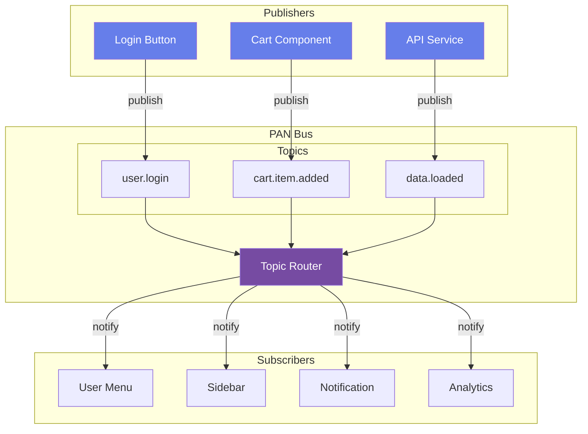
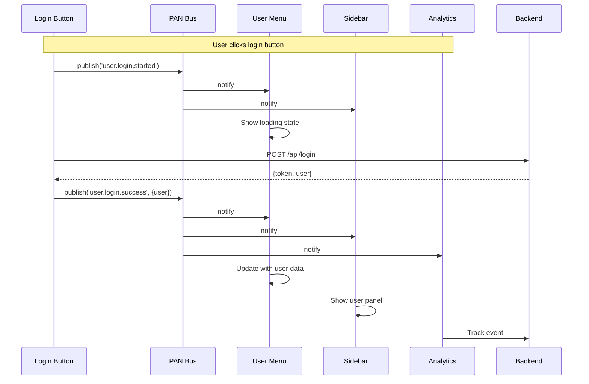
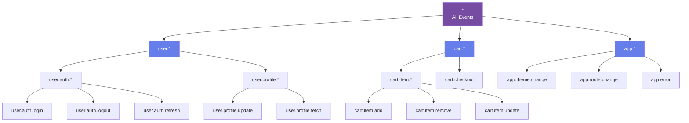
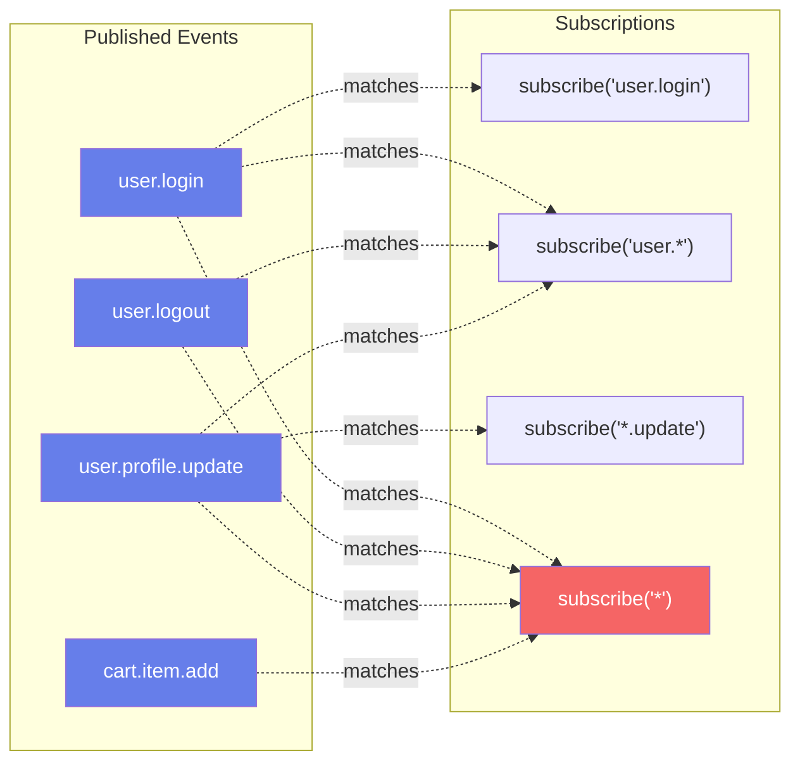
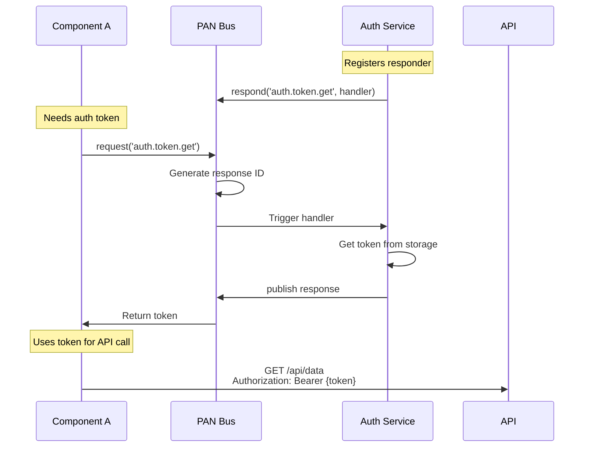
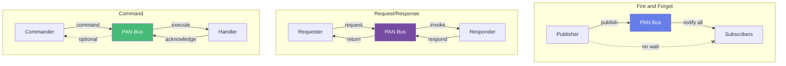
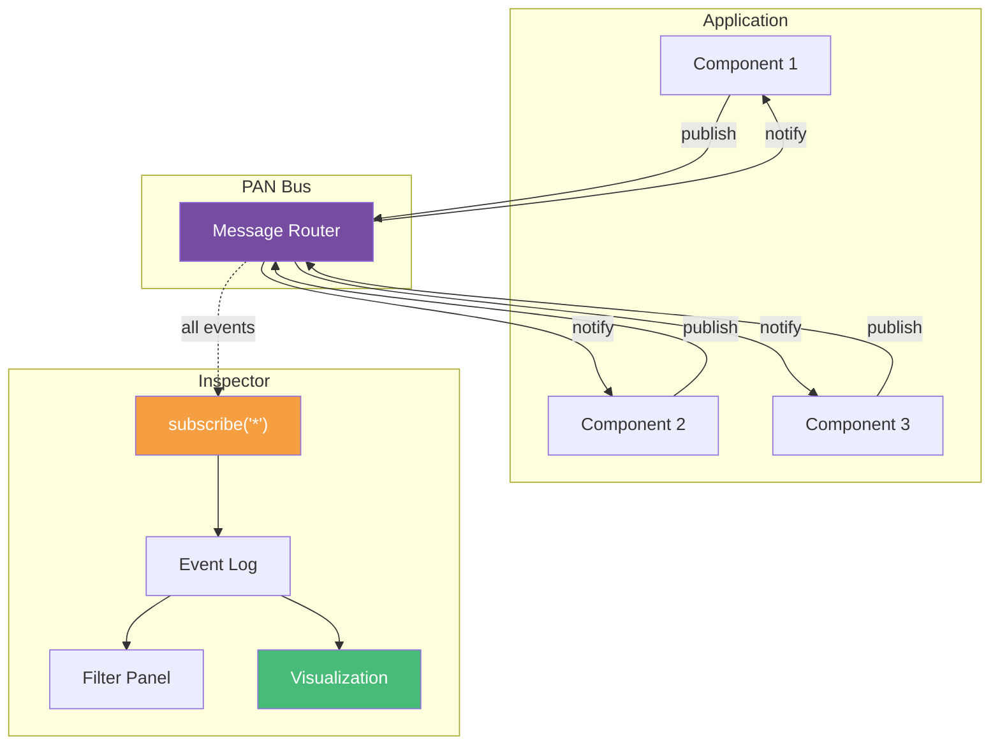
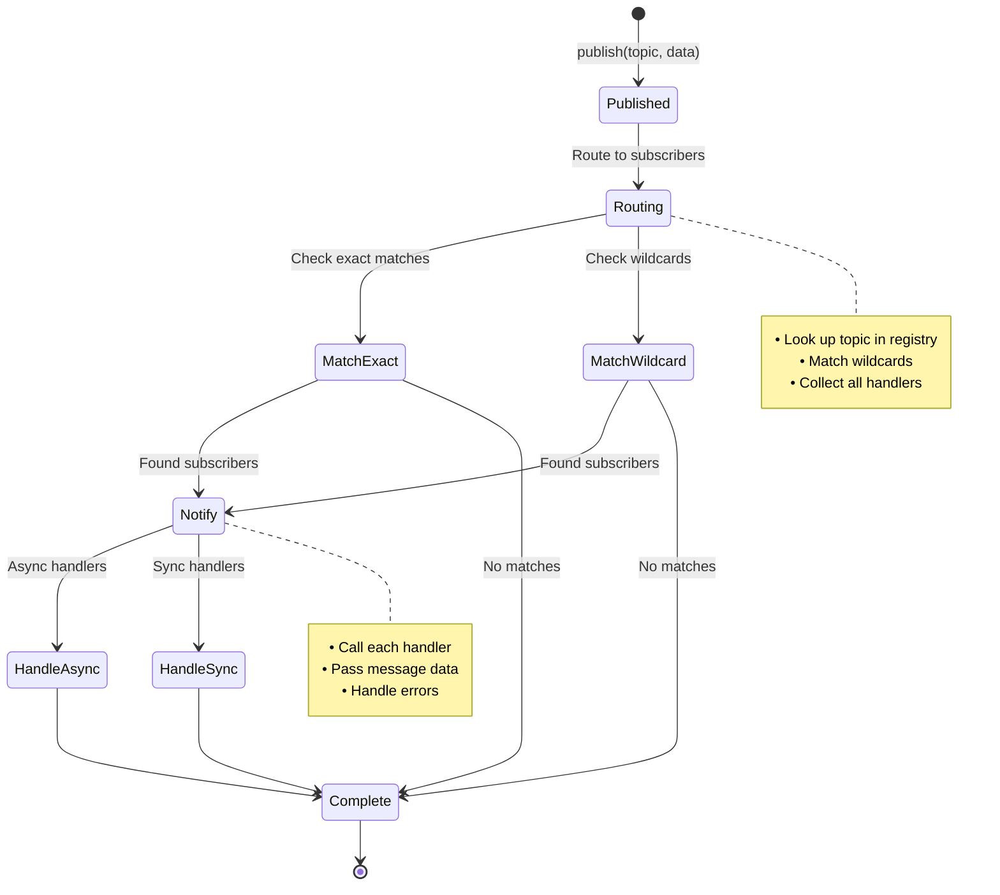
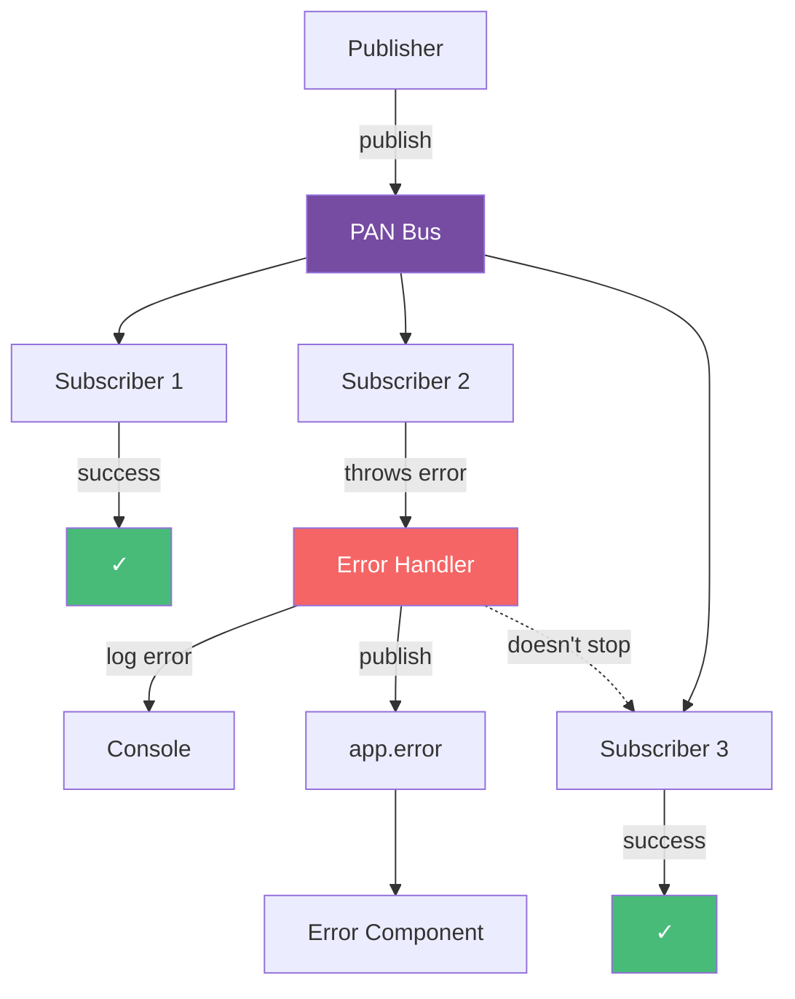

# PAN Bus Communication Patterns

## Pub/Sub Architecture



## Message Flow Sequence



## Topic Namespace Structure



## Wildcard Subscription Matching



## Request/Response Pattern



## Event Patterns Comparison



## PAN Bus Internal Architecture

```mermaid
graph TB
    subgraph "PAN Bus Core"
        Router[Topic Router]

        subgraph "Subscription Registry"
            Exact[Exact Matches<br/>Map&lt;topic, Set&lt;handler&gt;&gt;]
            Wildcard[Wildcard Patterns<br/>Array&lt;{pattern, handlers}&gt;]
        end

        subgraph "Message Queue"
            Queue[Event Queue]
            Batch[Batch Processor]
        end

        Router --> Exact
        Router --> Wildcard
        Router --> Queue
        Queue --> Batch
    end

    subgraph "API Methods"
        Publish[publish]
        Subscribe[subscribe]
        Request[request]
        Respond[respond]
    end

    Publish --> Router
    Subscribe --> Exact & Wildcard
    Request --> Router
    Respond --> Router

    style Router fill:#764ba2,color:#fff
    style Queue fill:#667eea,color:#fff
```

## Debugging with Event Inspector



## Event Lifecycle



## Error Handling in PAN Bus


