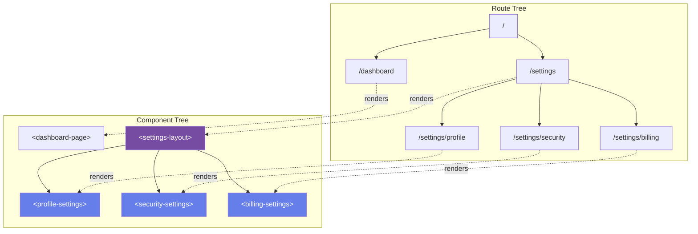
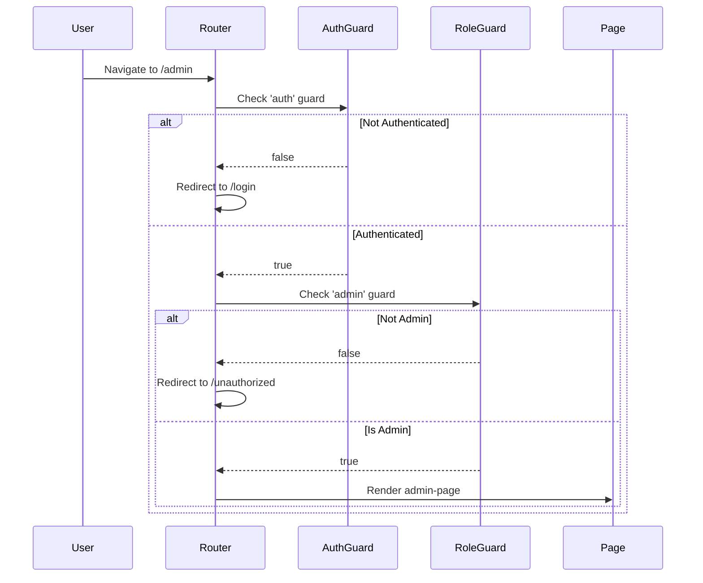
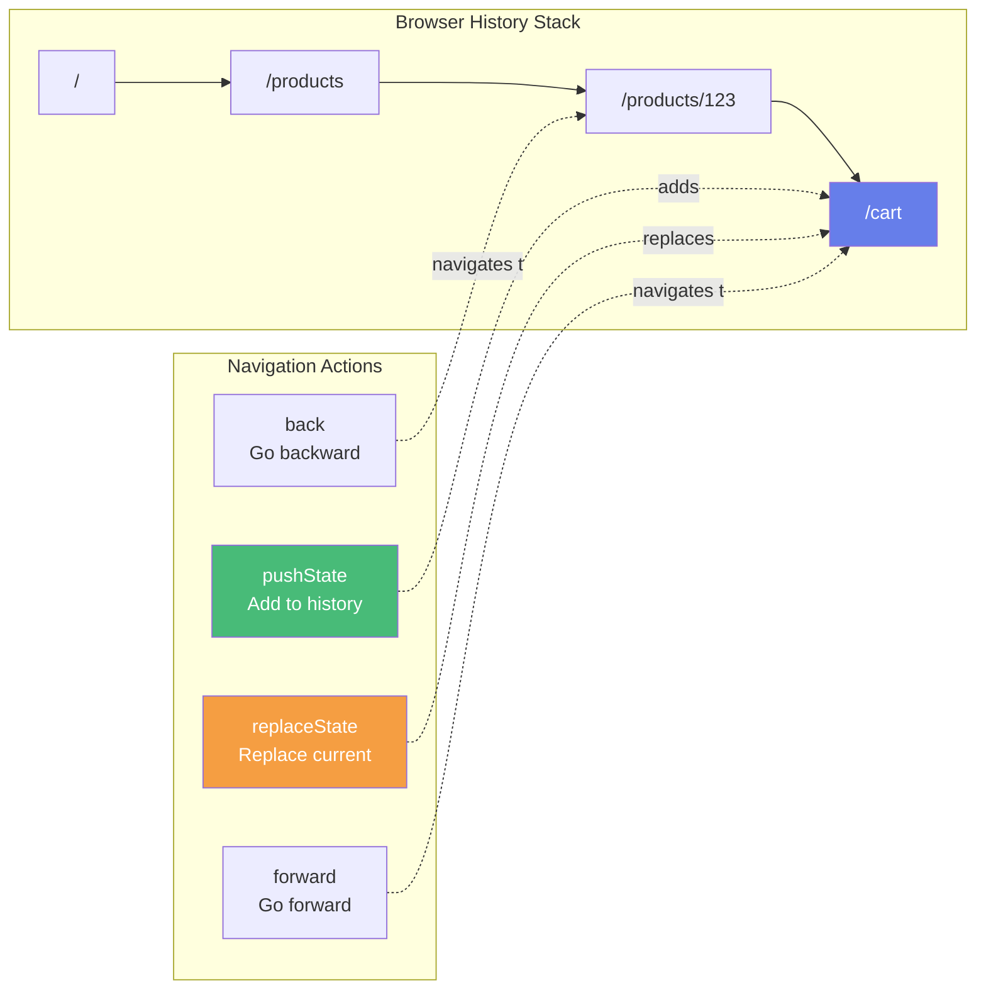
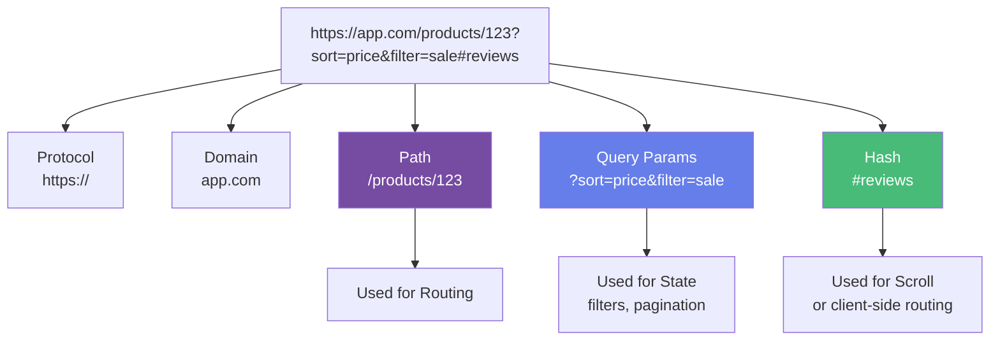
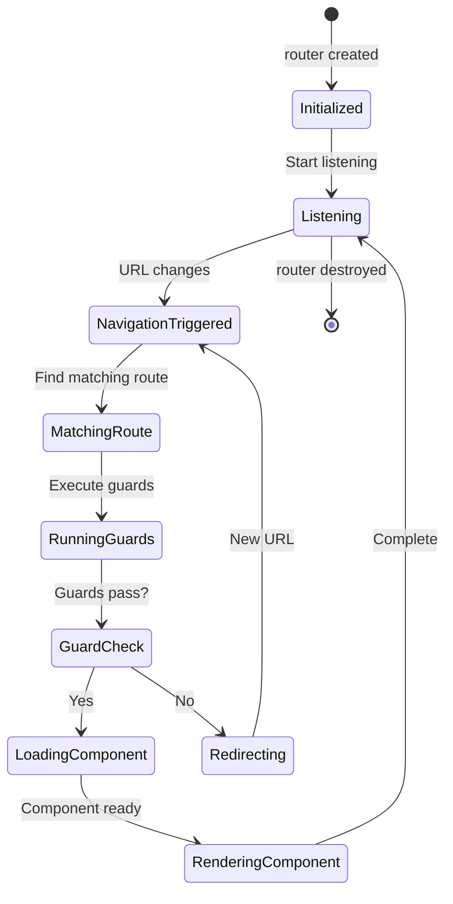
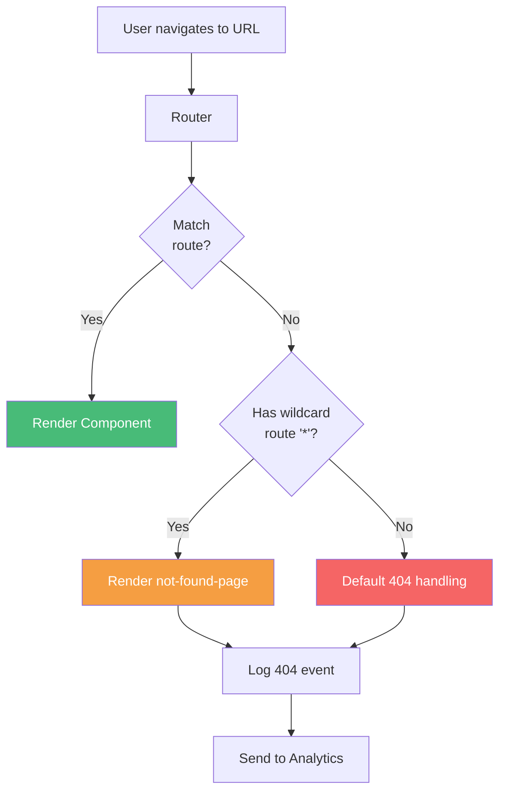
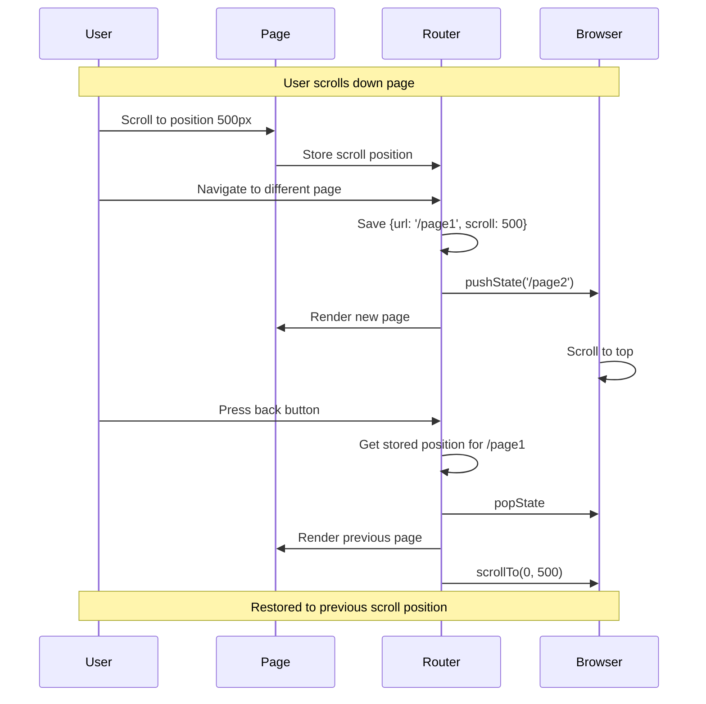

# Client-Side Routing

## Routing Architecture

```mermaid
graph TB
    subgraph "Browser"
        URL[URL Bar<br/>/users/123]
        History[History API]
        Links["&lt;a href='/users/123'&gt;"]
    end

    subgraph "pan-router"
        Router[Router Component]
        Routes[Route Registry<br/>{path, component, guard}]
        Matcher[Pattern Matcher]
        Outlet[Router Outlet<br/>&lt;div&gt;]
    end

    subgraph "Pages"
        Home[home-page]
        Users[user-page]
        NotFound[not-found-page]
    end

    URL --> Router
    Links -.intercept click.-> Router
    History <-.pushState.-> Router

    Router --> Routes
    Routes --> Matcher
    Matcher -->|match| Outlet

    Outlet -->|render| Home
    Outlet -->|render| Users
    Outlet -->|render| NotFound

    style Router fill:#764ba2,color:#fff
    style Outlet fill:#667eea,color:#fff
```

## Navigation Flow

```mermaid
sequenceDiagram
    participant User
    participant Link as &lt;a href="/users/123"&gt;
    participant Router as pan-router
    participant Guard as Route Guard
    participant Page as user-page
    participant Browser

    User->>Link: Click
    Link->>Router: preventDefault()<br/>navigate('/users/123')

    Router->>Router: Match route pattern
    Router->>Guard: Check guard('auth')

    alt Guard Passes
        Guard-->>Router: true

        Router->>Browser: pushState('/users/123')
        Router->>Router: Extract params {id: '123'}
        Router->>Page: Create component<br/>setAttribute('id', '123')
        Router->>Router: Replace outlet content

        Page->>Page: connectedCallback()
        Page->>Page: Load data
    else Guard Fails
        Guard-->>Router: false
        Router->>Router: Redirect to /login
    end
```

## Route Matching Algorithm

```mermaid
graph TB
    Start[URL: /users/123/posts/456]

    Start --> Parse[Parse URL<br/>['users', '123', 'posts', '456']]

    Parse --> Routes{Check Routes}

    Routes --> R1["/users/:id/posts/:postId"]
    Routes --> R2["/users/:id"]
    Routes --> R3["/posts/:id"]
    Routes --> R4["*"]

    R1 --> Match1{Match?}
    Match1 -->|Yes| Extract1[Extract params<br/>{id: '123', postId: '456'}]
    Match1 -->|No| R2

    R2 --> Match2{Match?}
    Match2 -->|No| R3

    R3 --> Match3{Match?}
    Match3 -->|No| R4

    R4 --> Fallback[404 Not Found]

    Extract1 --> Render[Render Component<br/>with params]

    style Extract1 fill:#48bb78,color:#fff
    style Fallback fill:#f56565,color:#fff
```

## Nested Routes



## Route Guards



## History Management



## URL Structure and Query Params



## Router Lifecycle



## Programmatic Navigation

```mermaid
graph TB
    subgraph "Navigation Methods"
        M1["pan.publish('router.navigate', {path})"]
        M2["pan.publish('router.back')"]
        M3["pan.publish('router.forward')"]
        M4["pan.publish('router.replace', {path})"]
    end

    subgraph "Router"
        Router[Router Component]
        History[History API]
    end

    subgraph "Results"
        R1[New Entry in History]
        R2[Go Back]
        R3[Go Forward]
        R4[Replace Current Entry]
    end

    M1 --> Router --> R1
    M2 --> Router --> R2
    M3 --> Router --> R3
    M4 --> Router --> R4

    Router <--> History

    style Router fill:#764ba2,color:#fff
```

## Link Interception

```mermaid
sequenceDiagram
    participant User
    participant Link as &lt;a href="/page"&gt;
    participant Document
    participant Router
    participant Browser

    User->>Link: Click

    Link->>Document: click event bubbles

    Document->>Router: Event listener catches

    Router->>Router: Check if internal link

    alt Internal Link (/page)
        Router->>Link: preventDefault()
        Router->>Router: Handle navigation
        Router->>Browser: pushState('/page')
        Router->>Router: Render component
    else External Link (https://external.com)
        Router->>Browser: Allow default behavior
        Browser->>Browser: Full page navigation
    end
```

## 404 Not Found Handling



## Scroll Restoration


