# Traditional Frameworks vs LARC

## Development Workflow Comparison

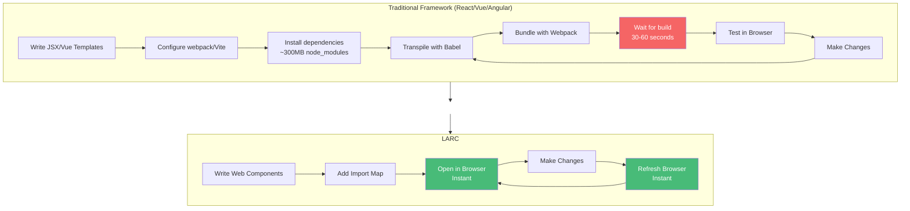

## Architecture Complexity

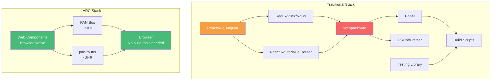

## Bundle Size Comparison

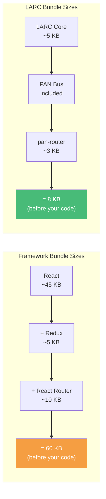

## Component Syntax Comparison

### React Component
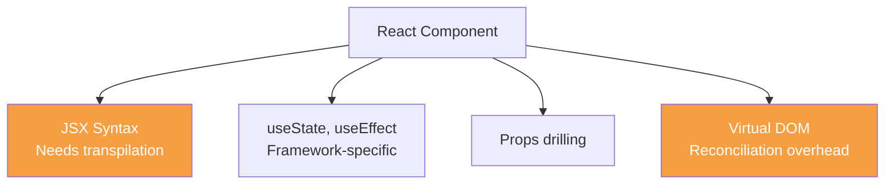

### LARC Component
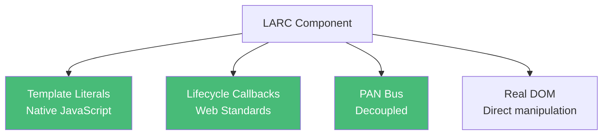

## Learning Curve

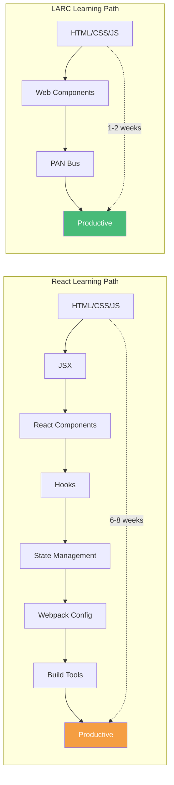

## State Management Comparison

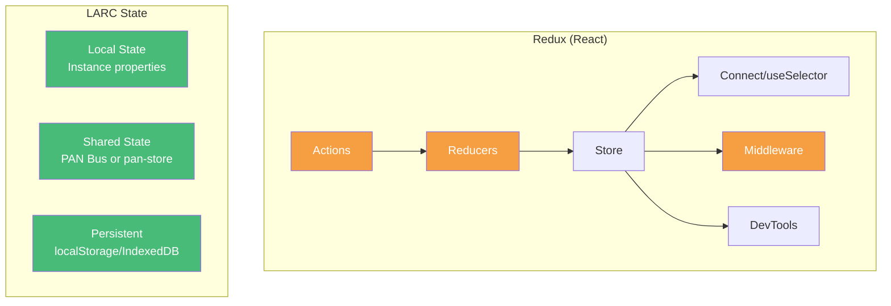

## Tooling Requirements

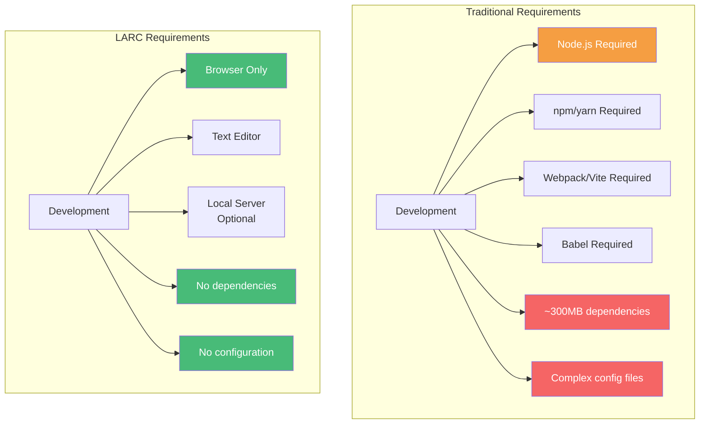

## Performance Characteristics

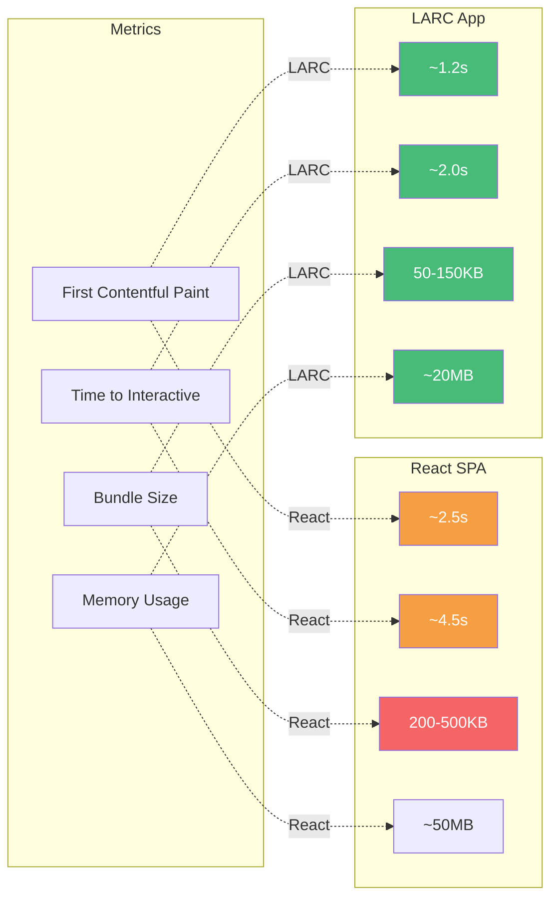

## Code Portability

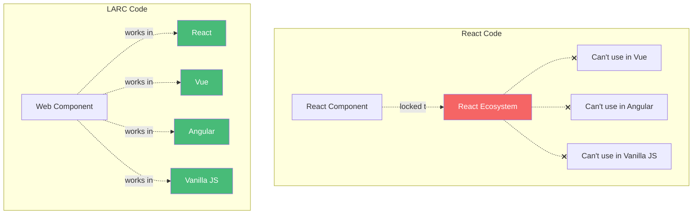

## Debugging Experience

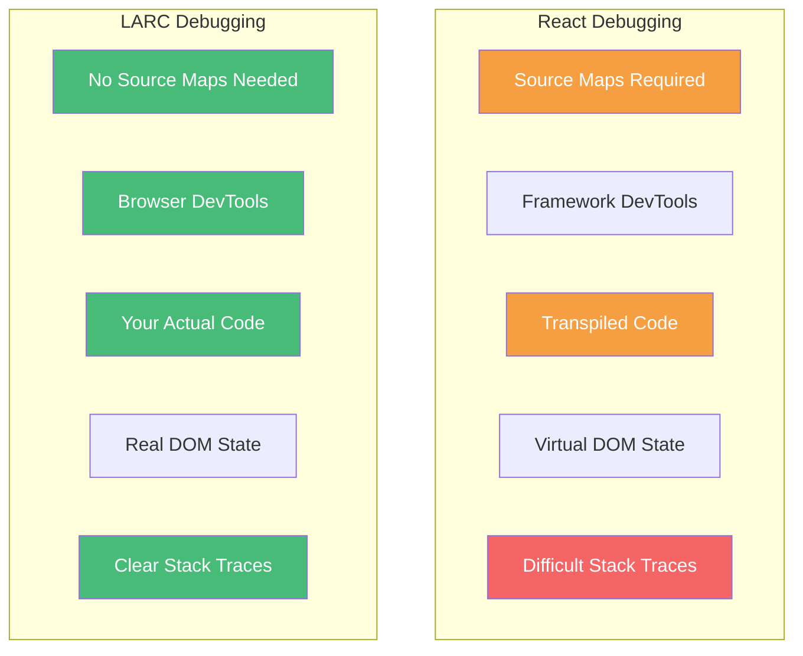

## Project Longevity

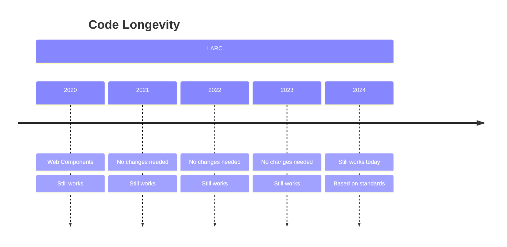

## When to Choose Each

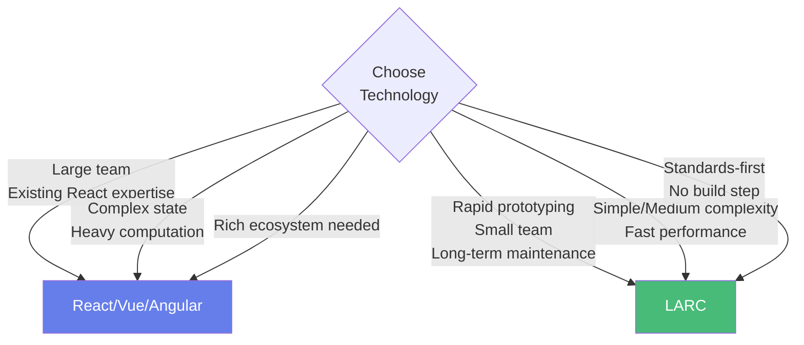

## Migration Path

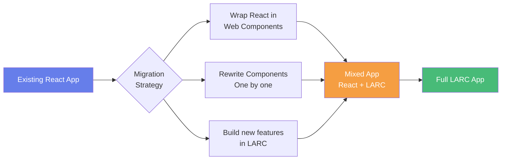
