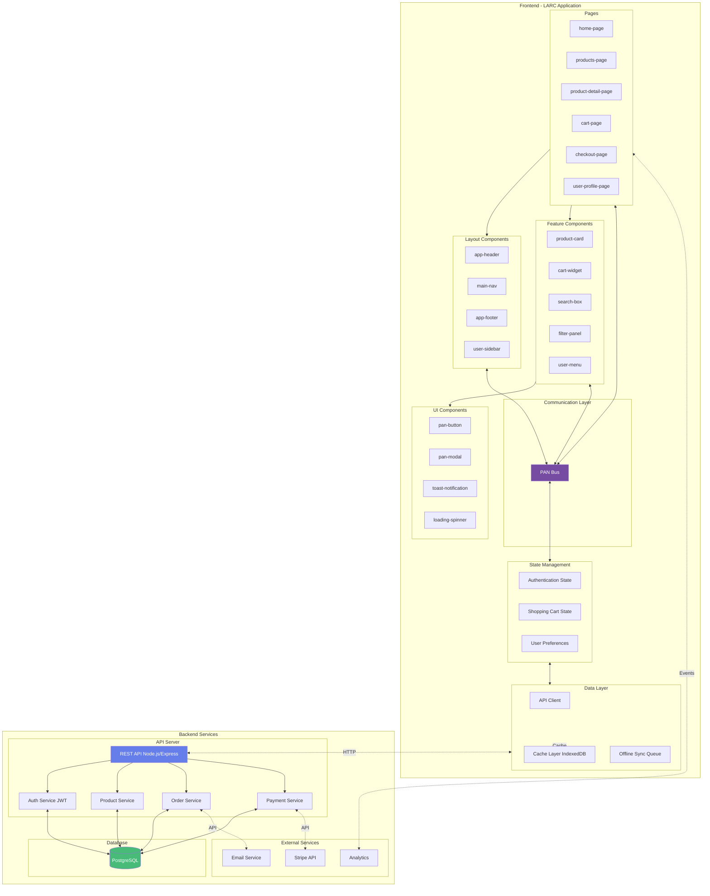
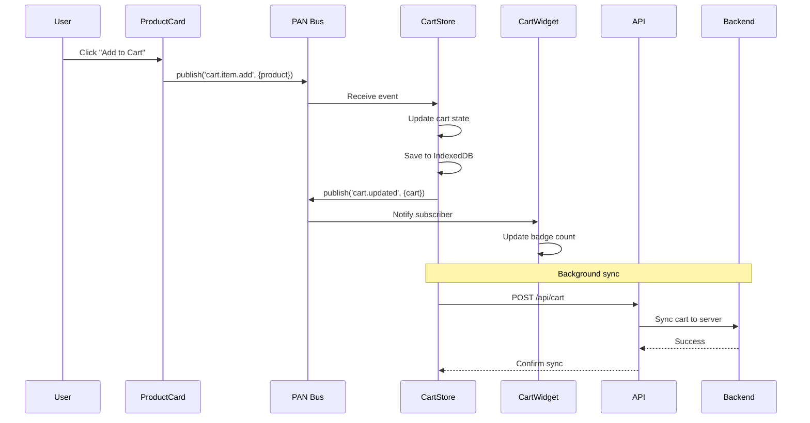
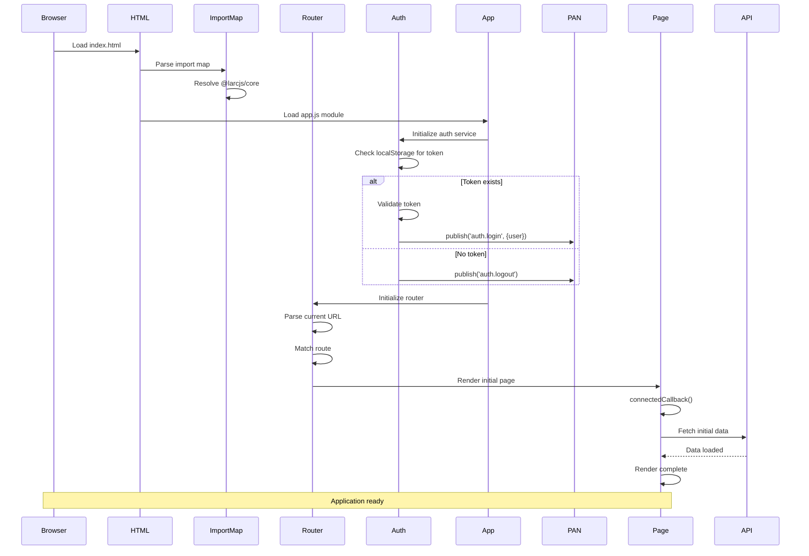
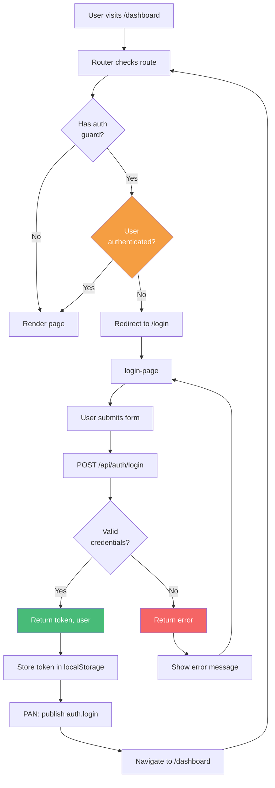
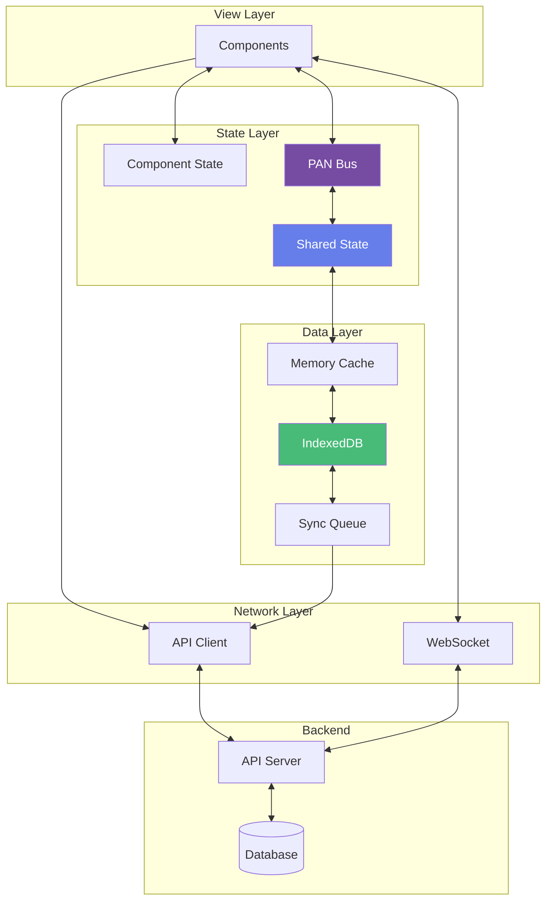
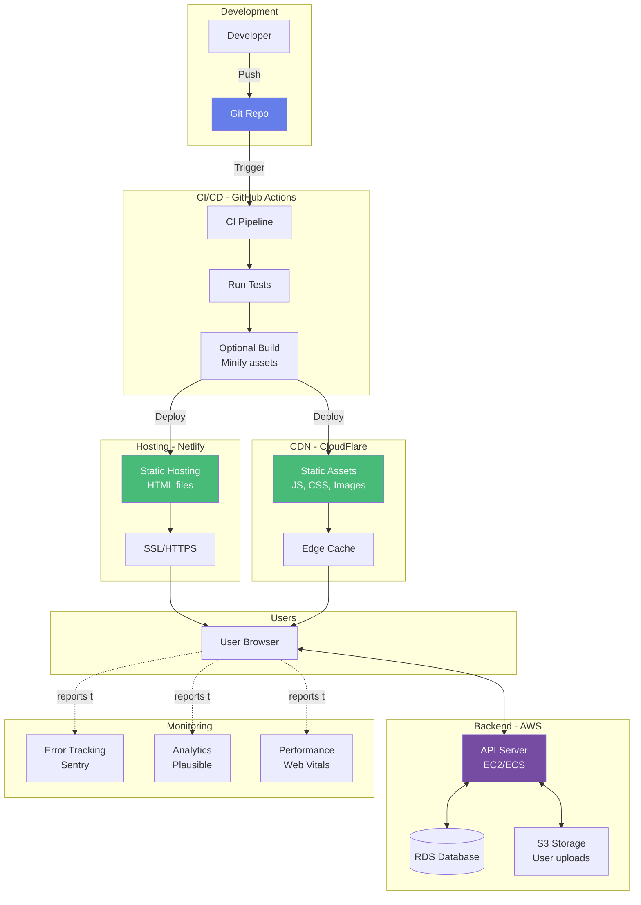
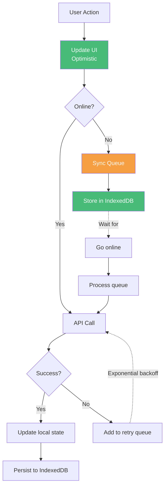
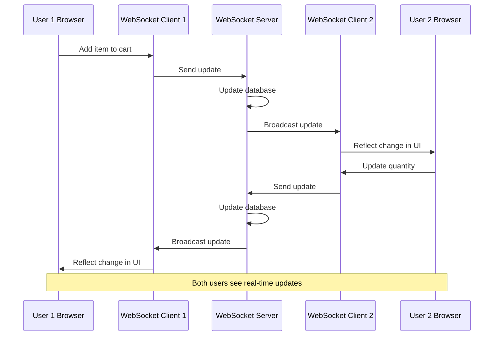
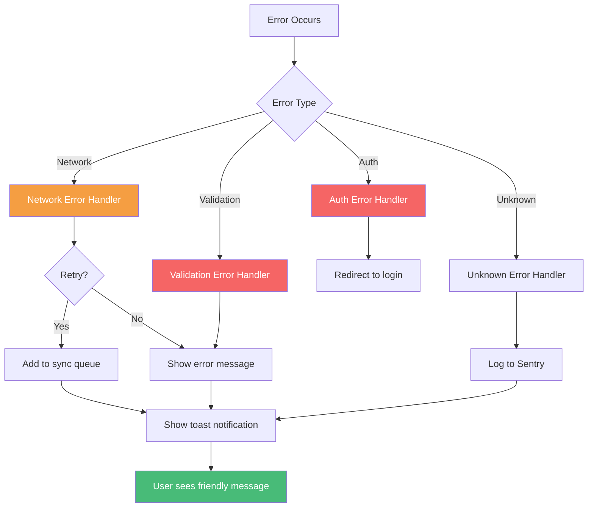
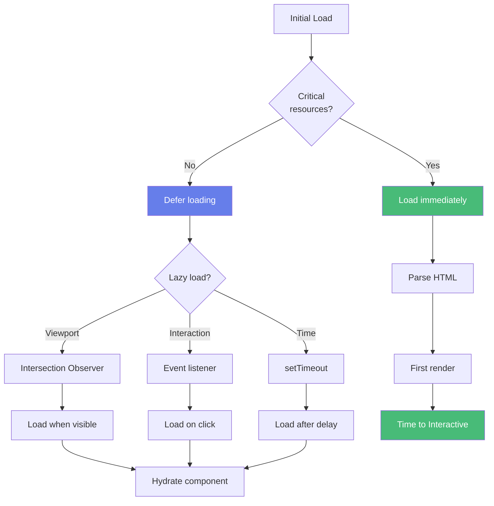

# Complete Application Architecture

## E-Commerce Application Example

## Component Interaction Flow

## Application Startup Sequence

## Authentication Flow

## Data Flow Architecture

## Deployment Architecture

## Offline-First Architecture

## Real-Time Updates Flow

## Error Handling Strategy

## Performance Optimization Strategy

