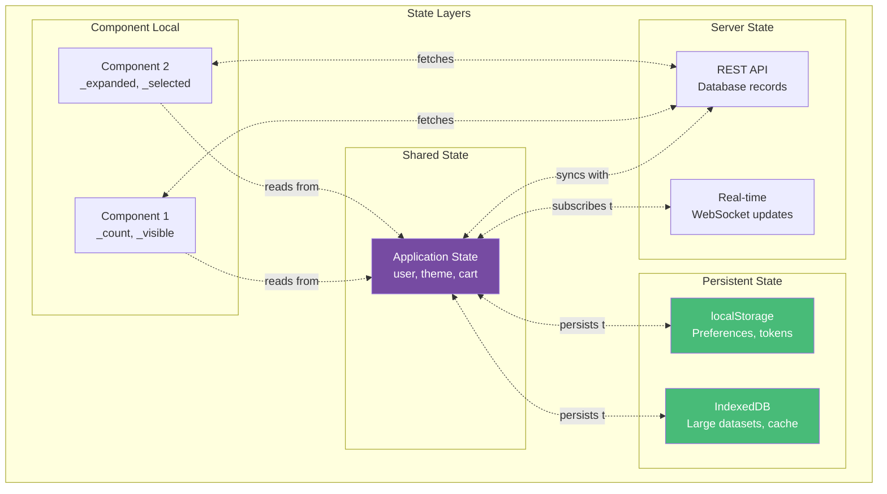
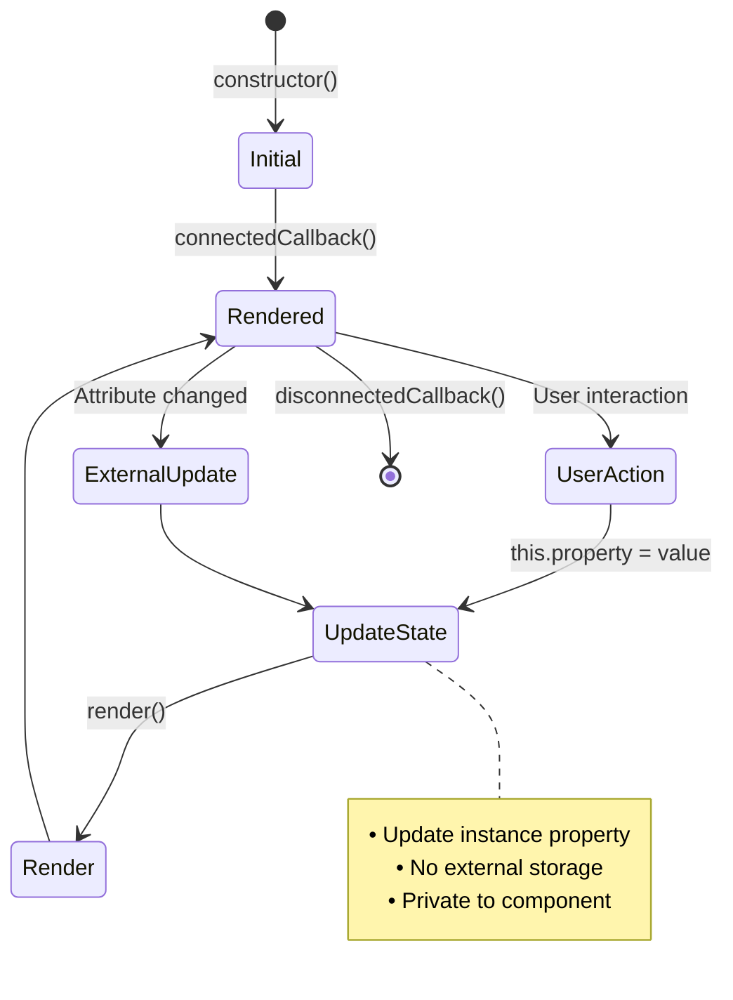
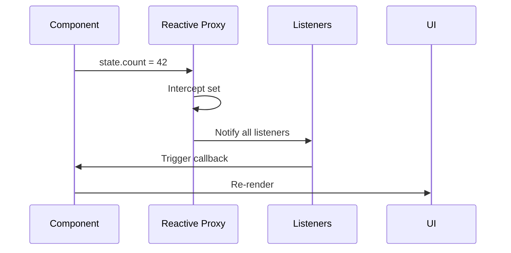
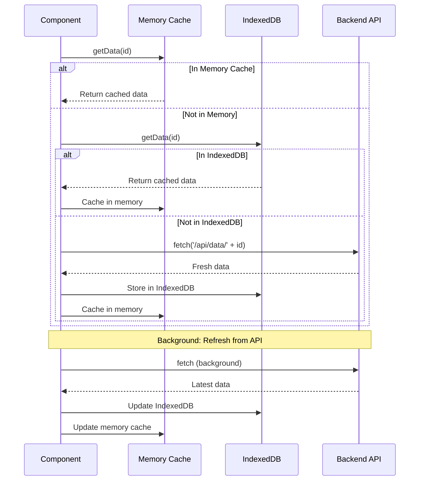
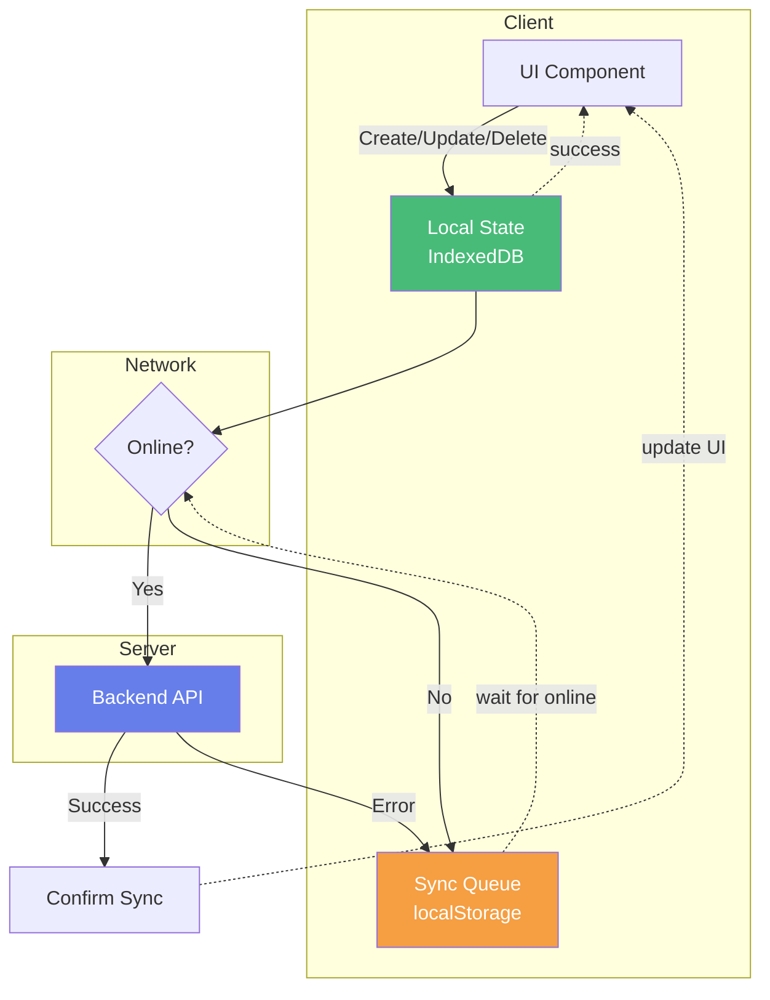
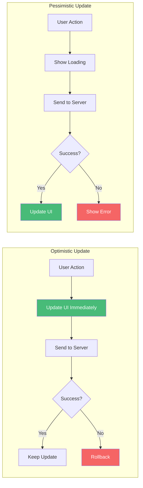
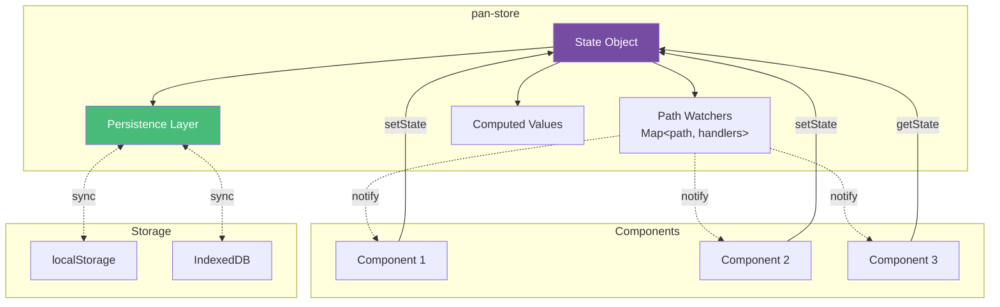
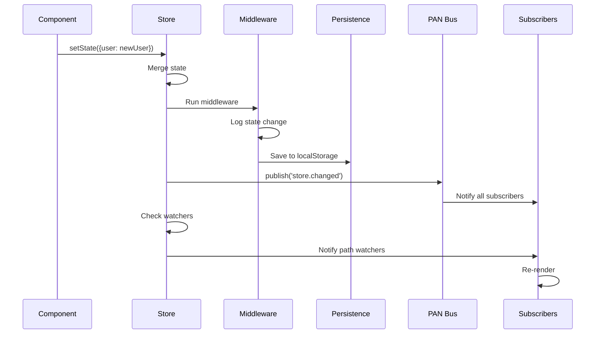
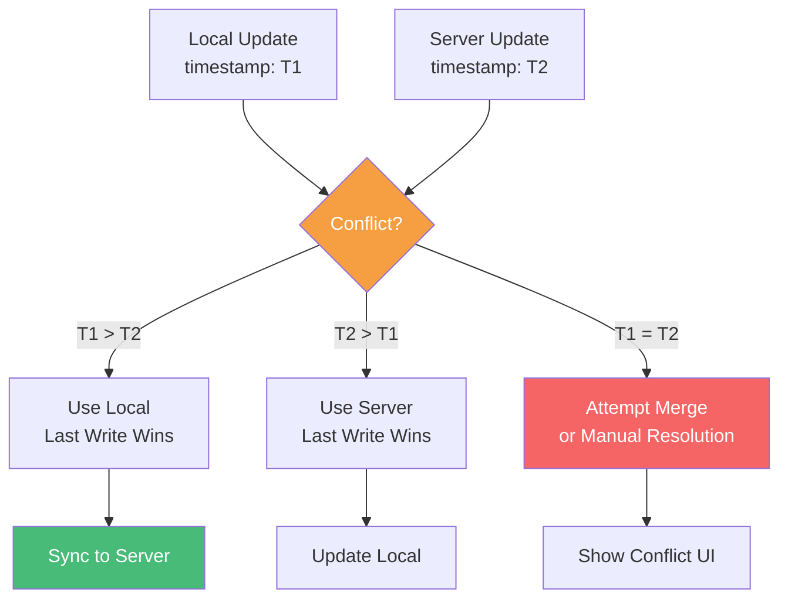
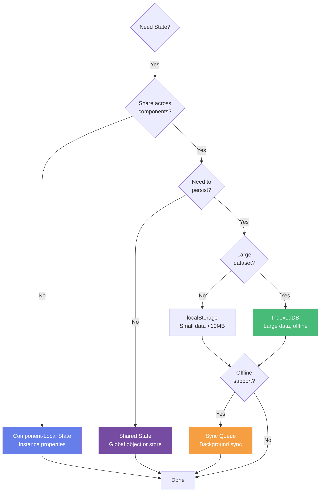

# State Management Patterns

## State Hierarchy



## Component-Local State Flow



## Reactive State with Proxy



## Shared State Pattern

```mermaid
graph TB
    subgraph "Store"
        State[Application State<br/>{user, theme, cart}]
        Listeners[Listeners Set]
    end

    subgraph "Components"
        C1[Component 1]
        C2[Component 2]
        C3[Component 3]
    end

    C1 -.subscribe.-> Listeners
    C2 -.subscribe.-> Listeners
    C3 -.subscribe.-> Listeners

    C1 -->|setState| State
    C2 -->|setState| State

    State -.notify.-> Listeners
    Listeners -.trigger.-> C1 & C2 & C3

    style State fill:#764ba2,color:#fff
    style Listeners fill:#667eea,color:#fff
```

## IndexedDB Cache-First Strategy



## Offline-First with Sync Queue



## State Synchronization Patterns



## pan-store Component Architecture



## State Update Flow



## Conflict Resolution



## State Management Decision Tree


